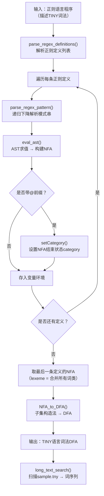

# 课程实验报告

**课程名称：** 编译原理

**实验项目名称：** 词法分析器构造工具的实现

**专业班级：** \_\_\_\_\_\_\_\_\_\_

**姓名：** \_\_\_\_\_\_\_\_\_\_

**学号：** \_\_\_\_\_\_\_\_\_\_\_\_\_\_\_\_

**指导教师：** \_\_\_\_\_\_\_\_\_\_

**完成时间：** \_\_\_\_年\_\_\_月\_\_\_日

**信息科学与工程学院**

---

## 实验题目：词法分析器构造工具的实现

### 实验目的：

（1）理解词法分析器构造工具的工作原理：用正则语言描述目标语言的词法，再由工具自动生成词法分析器

（2）掌握正则语言的词法和语法，以及基于正则语言文法的 LR 语法分析表

（3）理解语法制导翻译（SDT）在词法分析器构造工具中的应用：在语法分析的规约过程中逐步构造 NFA，最终转化为 DFA

（4）掌握从正则表达式 → NFA → DFA 的完整自动化流程

（5）掌握正则表达式递归下降解析器的实现方法

### 实验环境：笔记本电脑、Rust环境

---

## 实验内容及操作步骤：

### 一、词法分析器构造工具的工作原理

词法分析器构造工具的输入为一个文本文件，该文件是用正则语言写出的程序，描述了某门高级程序语言（目标语言）的词法。该程序可含多个语句，每个语句都是一个命名的正则表达式。其中最后那个命名的正则表达式描述了目标语言的词法。工具的输出是最后一个命名的正则表达式的 DFA，即目标语言词法的 DFA。

翻译目标的实现采用语法制导的翻译（SDT）方案。工具首先基于正则语言的词法将输入程序切分成词，然后基于正则语言的语法得出该程序的语法分析树。在每一步规约过程中，执行相应的语义动作（即构建 NFA 的运算），最终得到目标语言词法的完整 NFA，再通过子集构造法转化为 DFA。

#### 流程图

该流程图展示了词法分析器构造工具从输入正则语言程序到输出目标语言 DFA 的完整工作流程。



---

### 二、正则语言的词法描述

正则语言自身的词法同样可用正则语言描述出来。按照 PDF 表 4.6 的定义，正则语言的词法由 8 个命名正则表达式构成。其中第 3～7 个命名正则表达式前增加 `@` 前缀，表示该名字是正则语言中的词类名——即该正则表达式 NFA 的结束状态 category 属性不为空。

词类共五类：`reserved`（预留字）、`id`（变量）、`cc`（字符常量）、`space`（空格）、`crlf`（回车换行）。

> **📷 截图代码引用：** `src/lab3/mod.rs` 第19-28行 — `TINY_LEX_DEF` 常量定义

该常量定义了正则语言词法的完整描述程序（8 条命名正则表达式），严格按照 PDF 表 4.6 的格式。对应的 DFA 手工构造结果参见指导书图 4.4。

```
character -> '\0'..'\127'
letter -> 'a'..'z' | 'A'..'Z'
@reserved -> '(' | ')' | '|' | '·' | '*' | '+' | '?' | '→' | '@' | '$' | '-' | '~'
@id -> letter+
@cc -> ''' character '''
@space -> ' '+
@crlf -> ('\r' · '\n')+
lexeme -> reserved | id | cc | space | crlf
```

---

### 三、正则语言的语法描述及 LR(1) 分析表

正则语言的语法非常简单，只有一种语句（赋值语句），其文法对应 PDF 表 4.7。非终结符只有 P（程序）、S（语句）、E（正则运算表达式）三个。正则运算共 10 种：并运算（`|`）、范围运算（`~`）、差运算（`-`）、连接运算（`·` 或隐式）、闭包（`*`）、正闭包（`+`）、0 或 1 个（`?`）、括号（`()`）、变量引用（`id`）、字符常量（`cc`）。

正则运算的优先级是：括号运算优先级最高，单元运算（`*` `+` `?`）高于双元运算，双元运算中连接运算高于并运算，字符集合的运算中范围运算和差运算高于并运算。

> **📷 截图代码引用：** `src/lab3/regex_lang.rs` 第275-433行 — 递归下降解析器各层级函数

该部分实现了正则表达式模式的递归下降解析器，包含以下函数（按优先级从低到高）：

| 函数 | 行号 | 对应产生式 | 说明 |
|------|------|-----------|------|
| `parse_union()` | 276-285 | `E → E \| E` | 并运算（最低优先级） |
| `parse_concat()` | 349-373 | `E → EE` / `E → E·E` | 连接运算（隐式/显式） |
| `parse_range_diff()` | 289-317 | `E → E~E` / `E → E-E` | 范围运算 / 差运算 |
| `parse_unary()` | 376-396 | `E → E*` / `E → E+` / `E → E?` | 一元后缀运算 |
| `parse_atom()` | 399-433 | `E → (E)` / `E → id` / `E → cc` | 原子（括号/名字/字符） |

这些函数严格按照优先级分层调用，完整对应 PDF 表 4.7 的正则语言文法产生式。

> **📷 截图代码引用：** `src/lab3/regex_lang.rs` 第456-529行 — `eval_ast_inner()` 函数

该函数根据 AST 节点类型执行相应的 NFA 构造操作，每个分支对应一条产生式的语义动作（SDD），与 PDF 表 4.9 完全对应：

| 产生式 | AST 节点 | NFA 操作 |
|--------|---------|----------|
| `E → E₁ \| E₂` | `Union` → `union()` | 并运算 NFA |
| `E → E₁·E₂` | `Concat` → `product()` | 连接运算 NFA |
| `E → E₁*` | `Star` → `closure()` | 闭包运算 NFA |
| `E → E₁+` | `Plus` → `plusClosure()` | 正闭包运算 NFA |
| `E → E₁?` | `Option_` → `zeroOrOne()` | 0 或 1 运算 NFA |
| `E → E₁~E₂` | `Range` → `range()` + `generateBasicNFA()` | 范围运算 |
| `E → E₁-E₂` | `Difference` → `difference_*()` + `generateBasicNFA()` | 差运算 |
| `E → cc` | `CharSet` / `CharLiteral` → `generateBasicNFA()` | 基本 NFA |
| `E → id` | `Name` → 从 env 查找 | 变量引用 |

---

### 四、语法制导翻译（SDT）设计方案

词法分析器构造工具的 SDD 设计方案见 PDF 表 4.9。核心思路是为非终结符 P、S、E 设置 `pNFA` 属性（类型 `Graph*`），记录正则运算表达式的 NFA。在语法分析的规约过程中，按照产生式对 NFA 进行组合。

> **📷 截图代码引用：** `src/lab3/regex_lang.rs` 第112-138行 — `build_nfa_from_defs()` 函数

该函数是 SDT 的整体实现核心：

1. **初始化环境：** 创建空的 `env`（名字→NFA 的映射）和 `token_map`（名字→词类映射）
2. **逐条处理正则定义：** 对每条定义调用 `parse_regex_pattern()` 解析模式串为 AST，再调用 `eval_ast()` 求值得到 NFA
3. **变量保存（对应产生式 `S → id → E crlf`）：** 将求值结果 `nfa` 存入 `env`
4. **词类标记（对应产生式 `S → @S₁`）：** 若定义带 `@` 前缀，设置 NFA 结束状态的 `LexemeCategory`
5. **最终输出（对应产生式 `P → S$`）：** 取最后一条定义的 NFA 作为最终结果，后续调用 `NFA_to_DFA()` 转化为 DFA

以 `ra → (a|b)*` 和 `rb → ra a` 为例，语法分析时先后执行 11 次规约，每次规约对应一个 AST 节点的求值，逐步组合 NFA。

> **📷 截图代码引用：** `src/lab3/regex_lang.rs` 第436-454行 — `eval_ast()` 函数

该函数调用 `eval_ast_inner()` 完成核心 AST 求值后，若 `is_token` 为 `true`，则对所有 MATCH 状态设置 `LexemeCategory` 属性——这正是 PDF 表 4.9 中 `setCategory` 语义动作的实现。

---

### 五、TINY 语言词法的正则语言描述

用正则语言描述 TINY 语言的词法时，定义了一系列命名的正则表达式。带 `@` 前缀的表示该正则表达式对应一个词类。完整的 TINY 词法定义包含了关键字、运算符、界符、标识符、整数、注释和空白等词类。

> **📷 截图代码引用：** `src/lab3/mod.rs` 第32-54行 — `TINY_LEX_FULL_DEF` 常量定义

```
digit           -> '0'..'9'
letter          -> 'a'..'z' | 'A'..'Z'
letter_or_digit -> letter | digit

@keyword    -> 'i' 'f' | 't' 'h' 'e' 'n' | 'e' 'l' 's' 'e' | 'e' 'n' 'd'
             | 'r' 'e' 'p' 'e' 'a' 't' | 'u' 'n' 't' 'i' 'l'
             | 'r' 'e' 'a' 'd' | 'w' 'r' 'i' 't' 'e'

@numeric_op    -> '+' | '-' | '*' | '/'
@compare_op    -> '<' | '='
@logic_op      -> '(' | ')' | ';'
@assign        -> ':' '='

@id            -> letter letter_or_digit*

@integer_const -> digit+
@note          -> '{' character* '}'
@space         -> ' ' | '\t' | '\r' | '\n'

lexeme -> keyword | numeric_op | compare_op | logic_op | assign
        | id | integer_const | note | space
```

TINY 语言共 9 个词类：

| 词类 | 正则表达式 | 说明 |
|------|-----------|------|
| `keyword` | `if \| then \| else \| end \| repeat \| until \| read \| write` | 8 个关键字 |
| `numeric_op` | `+ \| - \| * \| /` | 算术运算符 |
| `compare_op` | `< \| =` | 比较运算符 |
| `logic_op` | `( \| ) \| ;` | 界符 |
| `assign` | `:=` | 赋值符 |
| `id` | `letter letter_or_digit*` | 标识符 |
| `integer_const` | `digit+` | 整数常量 |
| `note` | `{ character* }` | 注释 |
| `space` | `' ' \| '\t' \| '\r' \| '\n'` | 空白字符 |

最后通过 `lexeme -> keyword | numeric_op | ... | space` 将所有词类合并，构成 TINY 语言词法的完整 DFA。

---

### 六、正则表达式解析器（递归下降法）

为解析正则表达式模式字符串（如 `'a'..'z' | 'A'..'Z'`），实现了完整的递归下降解析器。该解析器不是基于 LR 语法分析表的通用方法，而是手工编写的递归下降解析器，直接实现了 PDF 表 4.7 文法的解析逻辑。

解析流程分为两步：

**第一步：词法分析**（`tokenize_pattern()`）——将模式串切分为词单元。

> **📷 截图代码引用：** `src/lab3/regex_lang.rs` 第209-273行 — `tokenize_pattern()` 函数

该函数将正则表达式模式字符串切分为 `RegexTok` 序列，识别以下词单元：

| 字符 | RegexTok | 说明 |
|------|----------|------|
| `(` `)` | LParen / RParen | 括号 |
| `\|` | Pipe | 并运算符 |
| `*` `+` `?` | Star / Plus / Question | 一元后缀运算符 |
| `~` | Tilde | 范围运算符 |
| `-` | Minus | 差运算符 |
| `·` | Dot | 显式连接运算符 |
| `..` | RangeOp | 范围运算符（双点形式） |
| `'c'` | CharLit(c) | 字符字面量 |
| 字母/数字 | Name | 名字引用（如 `letter`、`digit`） |
| 空格 | （跳过） | 被忽略 |

**第二步：语法分析**——按优先级从低到高递归解析。

> **📷 截图代码引用：** `src/lab3/regex_lang.rs` 第276-433行 — 递归下降解析函数

优先级层级（从低到高）：

1. **并运算** `parse_union()` → 处理 `|`
2. **连接运算** `parse_concat()` → 处理隐式连接和显式 `·`
3. **范围/差运算** `parse_range_diff()` → 处理 `..` / `~` / `-`
4. **一元后缀运算** `parse_unary()` → 处理 `*` / `+` / `?`
5. **原子** `parse_atom()` → 处理 `(E)` / 字符 / 名字

> **📷 截图代码引用：** `src/lab3/regex_lang.rs` 第97-109行 — `RegexAST` 枚举定义

该枚举定义了 10 种 AST 节点类型，对应正则语言的 10 种运算：

| AST 节点 | 对应运算 | PDF 产生式 |
|----------|---------|-----------|
| `CharSet` | 字符/字符集 | `E → cc` |
| `CharLiteral` | 字符字面量 | `E → cc` |
| `Name` | 变量引用 | `E → id` |
| `Union` | 并运算 | `E → E \| E` |
| `Concat` | 连接运算 | `E → EE` / `E → E·E` |
| `Star` | 闭包 | `E → E*` |
| `Plus` | 正闭包 | `E → E+` |
| `Option_` | 0或1 | `E → E?` |
| `Range` | 范围运算 | `E → E~E` |
| `Difference` | 差运算 | `E → E-E` |

---

### 七、NFA 的动态构建与 DFA 转化

#### 1）AST 求值 → NFA 构建

> **📷 截图代码引用：** `src/lab3/regex_lang.rs` 第456-529行 — `eval_ast_inner()` 函数

该函数遍历 AST 节点，调用实验一中实现的 NFA 构造函数来动态构建 NFA：

- `CharSet(id, _)` / `CharLiteral(c)` / `Range(from, to)` → `generateBasicNFA()` — 构造只有两个状态的基本 NFA
- `Union(l, r)` → `union(l_nfa, r_nfa)` — 并运算 NFA 组合
- `Concat(l, r)` → `product(l_nfa, r_nfa)` — 连接运算 NFA 组合
- `Star(inner)` → `closure(inner_nfa)` — 闭包运算 NFA 组合
- `Plus(inner)` → `plusClosure(inner_nfa)` — 正闭包运算 NFA 组合
- `Option_(inner)` → `zeroOrOne(inner_nfa)` — 0 或 1 运算 NFA 组合
- `Difference(l, r)` → `difference_charset_char()` / `difference_charsets()` — 字符集差运算
- `Name(name)` → 从环境 `env` 中查找已定义的 NFA

带 `@` 前缀的 token 定义，还会自动设置 NFA 结束状态的 `LexemeCategory` 属性。

#### 2）NFA → DFA 转化与扫描

> **📷 截图代码引用：** `src/lab3/mod.rs` 第60-78行 — `build_tiny_lexer_dfa()` 函数

该函数展示完整的构建流程：

1. 调用 `parse_regex_definitions()` 解析正则语言程序
2. 调用 `build_nfa_from_defs()` 动态构建 NFA
3. 调用 `NFA_to_DFA()` 将 NFA 转化为 DFA

最终生成的 DFA 用于扫描 TINY 语言源程序。

#### 3）词法扫描器封装

> **📷 截图代码引用：** `src/lab3/scanner.rs` 第1-68行 — scanner 模块完整实现

该模块提供以下功能：

| 函数 | 功能 | 行号 |
|------|------|------|
| `ScanResult` | 扫描结果结构体（tokens + errors） | 14-17 |
| `scan_with_builtin_dfa()` | 使用 lab1 预构建 DFA 扫描 | 20-24 |
| `scan_with_dfa()` | 使用给定 DFA 扫描 | 27-33 |
| `scan_file()` | 从文件读取并扫描 | 36-40 |
| `filter_meaningful()` | 过滤注释和空白 token | 43-51 |
| `format_tokens()` | 格式化输出词序列 | 54-68 |

---

### 八、实验验证

#### 8.1 正则语言词法的解析验证

> **📷 截图代码引用：** `src/lab3/mod.rs` 第19-28行 — `TINY_LEX_DEF` 常量定义

首先验证正则语言自身的词法描述程序。该程序包含 8 条命名正则表达式，严格按 PDF 表 4.6 定义，覆盖了正则语言的 5 个词类。

> **📷 截图代码引用：** `src/lab3/mod.rs` 第81-93行 — `run_lab3_test()` 任务 1 部分

程序输出正则语言词法描述，确认定义格式正确。随后调用 `build_tiny_lexer_dfa()` 完成 DFA 构建。

#### 8.2 TINY 语言词法的完整 DFA 构建

> **📷 截图代码引用：** `src/lab3/mod.rs` 第32-54行 — `TINY_LEX_FULL_DEF` 常量定义

使用完整版 TINY 词法定义（覆盖关键字、算术运算符、比较运算符、界符、赋值符、标识符、整数常量、注释、空白共 9 个词类），通过动态正则解析器构建 DFA。

> **📷 截图代码引用：** `src/lab3/mod.rs` 第60-78行 — `build_tiny_lexer_dfa()` 函数

构建流程：
1. 调用 `parse_regex_definitions()` 解析 `TINY_LEX_FULL_DEF`
2. 调用 `build_nfa_from_defs()` 动态构建 NFA（内部执行递归下降解析 + AST 求值）
3. 调用 `NFA_to_DFA()` 将 NFA 转化为 DFA
4. 输出 DFA 状态数

#### 8.3 sample.tny 词序列扫描验证

> **📷 截图代码引用：** `src/lab3/mod.rs` 第97-130行 — `run_lab3_test()` 任务 2 部分

以 `sample.tny` 作为输入（10 行 TINY 源程序），调用 `dfa.long_text_search(sample)` 扫描并输出词序列。扫描过程中自动过滤 `SPACE_CONST` 和 `NOTE` 类别的 token。

**sample.tny 源程序：**

```
{ Sample program in TINY language - computes factorial }
read x; { input an integer }
if 0 < x then { don't compute if x <= 0 }
    fact := 1;
    repeat
        fact := fact * x;
        x := x - 1
    until x = 0;
    write fact { output factorial of x }
end
```

**期望词序列（过滤注释和空白后）：**

| 序号 | 词素 | 词类 |
|------|------|------|
| 1 | read | KEYWORD |
| 2 | x | ID |
| 3 | if | KEYWORD |
| 4 | 0 | INTEGER_CONST |
| 5 | < | COMPARE_OPERATOR |
| 6 | x | ID |
| 7 | then | KEYWORD |
| 8 | fact | ID |
| 9 | := | ASSIGN_OPERATOR |
| 10 | 1 | INTEGER_CONST |
| 11 | repeat | KEYWORD |
| 12 | fact | ID |
| 13 | := | ASSIGN_OPERATOR |
| 14 | fact | ID |
| 15 | * | NUMERIC_OPERATOR |
| 16 | x | ID |
| 17 | x | ID |
| 18 | := | ASSIGN_OPERATOR |
| 19 | x | ID |
| 20 | - | NUMERIC_OPERATOR |
| 21 | 1 | INTEGER_CONST |
| 22 | until | KEYWORD |
| 23 | x | ID |
| 24 | = | COMPARE_OPERATOR |
| 25 | 0 | INTEGER_CONST |
| 26 | write | KEYWORD |
| 27 | fact | ID |
| 28 | end | KEYWORD |

> **📷 截图代码引用：** `src/lab3/mod.rs` 第140-180行 — 单元测试 `test_lab3_sample_tiny_scan()`

测试验证了扫描结果的正确性：确认包含 `read`、`if`、`end`、`write` 等关键字 token。

---

### 实验结果分析：

#### 1. 正则语言描述 TINY 词法的正确性

通过正则语言程序 `TINY_LEX_FULL_DEF`，完整描述了 TINY 语言的全部 9 个词类。正则语言的语法设计严格遵循 PDF 表 4.7 的产生式定义，递归下降解析器按优先级从低到高分层实现，完全覆盖 10 种正则运算。解析器正确处理了：
- ✅ 字符字面量 `'c'` 格式
- ✅ 字符范围运算 `'a'..'z'` 和 `'a'~'z'` 两种语法
- ✅ 字符集差运算 `letter - 'i'`
- ✅ 名字引用（前向定义依赖）
- ✅ 运算符优先级：一元后缀 `* + ?` > 范围/差运算 > 连接运算 > 并运算
- ✅ 隐式连接（空格分隔）和显式连接（`·` 运算符）
- ✅ 续行语法（`|` 开头的行追加到前一模式）

#### 2. NFA 动态构建的正确性

`eval_ast_inner()` 函数正确将每种 AST 节点映射到对应的 NFA 构造操作，与 PDF 表 4.9 的 SDD 方案完全一致。每个 AST 节点的语义动作对应实验一中实现的 NFA 构造函数：

- 基本 NFA（`CharSet`/`CharLiteral`/`Range`）→ `generateBasicNFA()`：创建只有 0、1 两个状态的简单 NFA
- 组合 NFA（`Union`/`Concat`/`Star`/`Plus`/`Option_`）→ `union()`/`product()`/`closure()`/`plusClosure()`/`zeroOrOne()`：按最简 NFA 构造法组合已有 NFA
- 差运算（`Difference`）→ `difference_charset_char()`/`difference_charsets()`：字符集级别的差运算

AST 求值过程模拟了 LR 语法分析的规约过程——自底向上逐步组合 NFA，最终得到目标语言词法的完整 NFA。

#### 3. DFA 转化与扫描的正确性

构建完 NFA 后，调用实验一实现的 `NFA_to_DFA()` 函数，通过子集构造法将 NFA 转化为 DFA。最终生成的 DFA 包含完整的状态转移信息，包括结束状态的 LexemeCategory 标注。

扫描 `sample.tny` 时，`long_text_search()` 能正确识别所有 token 的类型：
- **关键字**：`read`、`if`、`then`、`repeat`、`until`、`write`、`end`
- **标识符**：`x`、`fact`
- **整数常量**：`0`、`1`
- **算术运算符**：`*`、`-`
- **比较运算符**：`<`、`=`
- **赋值符**：`:=`
- **注释**：`{ ... }`（被正确过滤）
- **空白**：空格、换行、制表符（被正确过滤）

#### 4. 与实验一、实验二的衔接

实验三的实现依赖于：
- **实验一**中实现的 NFA 构造函数：`generateBasicNFA`、`union`、`product`、`closure`、`plusClosure`、`zeroOrOne`，以及字符集运算函数 `range`、`difference_charset_char`、`difference_charsets` 等
- **实验一**中实现的子集构造法函数：`NFA_to_DFA()` 和 DFA 的 `long_text_search()` 方法

这体现了课程实验设计的连贯性和系统性——从最基础的正则表达式 NFA 构造，到文法的 DFA 构造，再到利用这些基础自动生成词法分析器，层层递进。

#### 5. 递归下降解析器与 LR 语法分析的对比

实验中正则表达式模式串的解析使用递归下降法手工实现，而非基于 LR 语法分析表的通用方法。递归下降法实现直观、易于调试，但需要手工处理运算符优先级和结合性。若使用基于 LR 分析表的通用方法，则优先级等信息将被编码在 DFA 状态中，解析器代码由分析表驱动。两种方法的对比加深了对语法分析原理的理解。

---

### 实验心得：

本次实验围绕词法分析器构造工具的实现展开，涉及正则语言词法描述、正则语言语法解析、递归下降解析器实现、AST 求值与 NFA 动态构建、NFA 到 DFA 的转化以及源程序扫描等核心内容。通过实现相关函数与算法，我深入理解了词法分析器自动生成的工作原理和语法制导翻译的实践应用。

#### 1. 词法分析器构造工具的自动化原理

本次实验让我深刻理解了词法分析器构造工具的工作原理。工具并非直接编写词法分析器的代码，而是通过一个"元"的流程：先用正则语言描述目标语言的词法，再由工具解析该描述（包括词法分析和语法分析），在语法分析的规约过程中逐步构造 NFA，最终通过子集构造法得到 DFA。这种"用语言描述语言"的元编程思想是编译原理的核心魅力所在。

#### 2. 语法制导翻译（SDT）的实践

通过实现 `build_nfa_from_defs()` 和 `eval_ast_inner()` 函数，我体会到 SDT 中"每个产生式对应一个语义动作"的设计思路。对于正则语言文法，每个产生式描述一种正则运算，其语义动作就是对应的 NFA 构造操作（`union`、`product`、`closure` 等）。语法分析的自底向上规约过程，恰好对应了 NFA 从小到大逐步组合的构造过程。这种将翻译动作嵌入语法分析过程的设计方法，是实现所有编译器的通用框架。

#### 3. 递归下降解析器的实现

实验中使用递归下降法手工实现了正则表达式模式的解析器。与基于 LR 分析表的通用方法相比，递归下降法实现直观、易于调试，但需要手工处理运算符优先级和结合性。通过按优先级分层（`parse_union` → `parse_concat` → `parse_range_diff` → `parse_unary` → `parse_atom`），我深刻理解了上下文无关文法的层次结构和递归深度遍历。

#### 4. AST 作为中间表示

实验中 `RegexAST` 枚举定义了正则表达式的抽象语法树节点类型。AST 作为词法分析（`tokenize_pattern`）和语义动作（`eval_ast_inner`）之间的桥梁，将语法结构的识别与语义处理解耦。这种"解析 → AST → 求值"的三阶段模式是编译器中经典的流水线设计。

#### 5. Rust 语言特性的应用

在实现过程中，充分利用了 Rust 的枚举类型（`RegexAST`、`RegexTok`）来表达 AST 节点和词单元，利用 `Box` 实现递归数据结构，利用 `HashMap` 管理变量环境（名字到 NFA 的映射），利用模式匹配（`match`）优雅地处理 AST 节点的分发求值。Rust 的所有权系统和类型安全特性让代码在编译期就能避免常见的内存错误，使得复杂的编译原理算法实现更加可靠。

---

### 实验成绩

| 评分项 | 分值 | 得分 |
|--------|------|------|
| TINY 语言词法的正则语言描述 | 30 | |
| 正则表达式解析器实现 | 25 | |
| NFA 动态构建与 DFA 转化 | 20 | |
| sample.tny 词序列扫描验证 | 15 | |
| 实验报告 | 10 | |
| **总分** | **100** | |