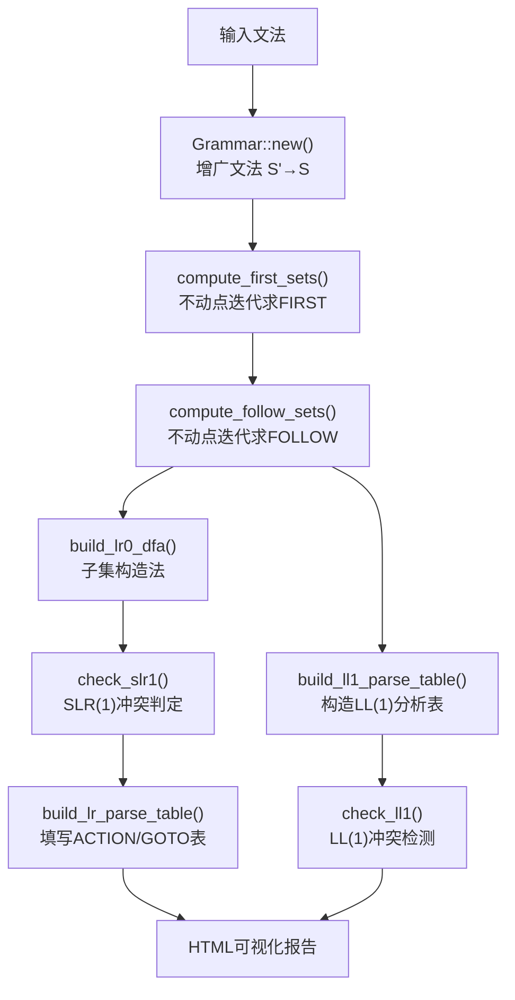

# 课程实验报告

**课程名称：** 编译原理

**实验项目名称：** 上下文无关文法的DFA构建

**专业班级：** \_\_\_\_\_\_\_\_\_\_

**姓名：** \_\_\_\_\_\_\_\_\_\_

**学号：** \_\_\_\_\_\_\_\_\_\_\_\_\_\_\_\_

**指导教师：** \_\_\_\_\_\_\_\_\_\_

**完成时间：** \_\_\_\_年\_\_\_月\_\_\_日

**信息科学与工程学院**

---

## 实验题目：上下文无关文法的DFA构建

### 实验目的：

（1）学习和掌握产生式与非终结符的FIRST函数求解方法

（2）学习和掌握非终结符的FOLLOW函数求解方法

（3）掌握LR(0)项集闭包求解与DFA构造的子集构造法

（4）掌握SLR(1)文法的判定方法与LR语法分析表的填写

（5）掌握LL(1)语法分析表的构造与冲突检测

### 实验环境：笔记本电脑、Rust环境

---

## 实验内容及操作步骤：

### 一、基本数据结构

整个实验二的设计方案严格遵循了从上下文无关文法到语法分析表的经典编译原理流水线，同时充分利用了Rust的类型系统和数据结构特性（如BTreeMap、BTreeSet、VecDeque）来保障内存安全与运行效率。

#### 流程图

该流程图展示了从上下文无关文法输入，经过FIRST/FOLLOW集计算、LR(0) DFA构造、SLR(1)冲突判定与LR语法分析表填写，以及并行的LL(1)语法分析表构造与冲突检测的全生命周期。



#### 1）文法符号类型

> **📷 截图代码引用：** `src/lab2/types.rs` 第7-12行 — `SymbolType` 枚举定义

文法符号分为三类：终结符（`Terminal`）、非终结符（`NonTerminal`）和空符号（`Null`）。采用Rust的枚举类型实现，保证类型安全。

#### 2）文法符号 & 产生式

> **📷 截图代码引用：** `src/lab2/types.rs` 第14-36行 — `GrammarSymbol` 和 `Production` 结构体定义

- `GrammarSymbol`：包含符号名称`name`、符号类型`sym_type`、该非终结符的所有产生式编号列表`productions`、FIRST集`first_set`、FOLLOW集`follow_set`以及FOLLOW依赖集`dependent_in_follow`（对应PDF中的`pDependentSetInFollow`）。
- `Production`：包含产生式编号`production_id`、产生式头`head`、产生式体`body`（文法符号序列）以及该产生式的FIRST集`first_set`。提供`is_epsilon()`方法判断是否为空产生式。

#### 3）文法定义

> **📷 截图代码引用：** `src/lab2/types.rs` 第38-46行 — `Grammar` 结构体定义

`Grammar`结构体为核心数据结构，包含文法符号表`symbols`（BTreeMap）、产生式列表`productions`、起始符号`root_symbol`、增广起始符号`aug_root`、终结符列表`terminals`和非终结符列表`non_terminals`。

#### 4）LR(0)项 & 项集

> **📷 截图代码引用：** `src/lab2/types.rs` 第48-69行 — `LR0Item` 和 `ItemSet` 结构体定义

- `LR0Item`：由产生式编号`production_id`和圆点位置`dot_position`唯一确定，实现了`PartialEq + Eq + PartialOrd + Ord + Hash`，可直接用于BTreeSet去重。
- `ItemSet`：包含状态编号`state_id`、核心项集合`core_items`（对应PDF中的CORE类别）和完整项集合`items`（核心项+闭包扩展的非核心项）。通过`ItemSet::new()`构造函数创建，初始时核心项与完整项相同。

#### 5）变迁边 & LR(0) DFA

> **📷 截图代码引用：** `src/lab2/types.rs` 第71-83行 — `TransitionEdge` 和 `LR0DFA` 结构体定义

- `TransitionEdge`：包含驱动符号`driver_symbol`（对应PDF的`GrammarSymbol* driverSymbol`）、源状态`from_state`和目标状态`to_state`。
- `LR0DFA`：包含项集列表`item_sets`、变迁边列表`edges`和起始状态编号`start_state`。

#### 6）LR语法分析表

> **📷 截图代码引用：** `src/lab2/types.rs` 第85-108行 — `ActionCategory`枚举、`ActionCell`、`GotoCell`、`LRParseTable` 结构体定义

- `ActionCategory`枚举：Shift（移入）、Reduce（规约）、Accept（接受）。
- `ActionCell`：存储动作类型`action_type`和对应状态/产生式编号`id`。
- `GotoCell`：存储下一状态编号`next_state`。
- `LRParseTable`：包含ACTION表（键为`(状态, 终结符)`的BTreeMap）、GOTO表（键为`(状态, 非终结符)`的BTreeMap）以及冲突列表`conflicts`。

#### 7）LL(1)语法分析表

> **📷 截图代码引用：** `src/lab2/types.rs` 第110-113行 — `LL1ParseTable` 结构体定义

`LL1ParseTable`包含`cells`字段，键为`(非终结符, 终结符)`的BTreeMap，值为对应的产生式编号列表，支持多条产生式（用于冲突检测）。

---

### 二、FIRST函数的实现

#### 1）`pub fn first_of_sequence(grammar: &Grammar, seq: &[String]) -> BTreeSet<String>`

> **📷 截图代码引用：** `src/lab2/first.rs` 第5-39行 — `first_of_sequence` 函数完整实现

**函数作用：** 求解文法符号序列（产生式的体）的FIRST集。

**实现方法：**

1. 空序列（ε产生式）直接返回`{ε}`。
2. 依次遍历序列中的每个符号，将其FIRST集中的非ε符号加入结果集。
3. 若当前符号的FIRST集包含ε，则继续处理下一个符号；否则停止。
4. 若所有符号的FIRST集均包含ε，则在结果中加入ε。

#### 2）`pub fn compute_first_sets(grammar: &mut Grammar)`

> **📷 截图代码引用：** `src/lab2/first.rs` 第41-70行 — `compute_first_sets` 函数完整实现

**函数作用：** 为文法中所有非终结符和所有产生式计算FIRST集。

**实现方法：** 采用不动点迭代算法（Fixed-point iteration）。
1. 在`loop`循环中每次迭代先快照当前所有产生式。
2. 对每条产生式，调用`first_of_sequence()`计算其FIRST集。
3. 将新得到的符号同时插入到产生式的`first_set`和对应非终结符的`first_set`中。
4. 若某轮迭代无任何新符号加入（`changed == false`），则收敛终止。

---

### 三、FOLLOW函数的实现

#### `pub fn compute_follow_sets(grammar: &mut Grammar)`

> **📷 截图代码引用：** `src/lab2/follow.rs` 第4-74行 — `compute_follow_sets` 函数完整实现

**函数作用：** 计算文法的FOLLOW集。

**实现方法：** 同样采用不动点迭代算法，严格遵循FOLLOW集的三条经典规则：

1. **规则1（初始化）：** 对增广开始符号`S'`和原始开始符号`S`，将结束标记`$`插入其FOLLOW集。
2. **规则2（FIRST传递）：** 对产生式`A → αBβ`，将`FIRST(β) \ {ε}`加入`FOLLOW(B)`。
3. **规则3（FOLLOW传递）：** 对产生式`A → αB`或`A → αBβ`且`β ⇒* ε`，将`FOLLOW(A)`加入`FOLLOW(B)`。同时通过`dependent_in_follow`字段记录B依赖于A的关系。

在每轮迭代中遍历所有产生式的每个位置：
- 若当前符号为非终结符，取其后的子序列`β`计算`FIRST(β)`，将非ε符号加入该非终结符的FOLLOW集。
- 若`β`为空或`FIRST(β)`包含ε，则将该符号标记为依赖产生式头`A`，并将`FOLLOW(A)`中的符号传递过来。
- 直到整轮迭代无新符号加入时收敛。

---

### 四、LR(0)项集闭包求解与DFA构造

#### 1）`pub fn get_closure(item_set: &mut ItemSet, grammar: &Grammar)`

> **📷 截图代码引用：** `src/lab2/lr0.rs` 第5-27行 — `get_closure` 函数完整实现

**函数作用：** 对一个LR(0)项集求解其闭包（对应PDF中的`void getClosure(ItemSet* itemSet)`）。

**实现方法：**
1. 以当前项集的核心项（`core_items`）初始化一个工作队列（VecDeque）。
2. 循环从队列中取出LR(0)项，检查其圆点后的下一个文法符号。
3. 若该符号为非终结符`B`，则将`B`的所有产生式（圆点在开头位置0）作为新项插入项集。
4. 若新项成功插入（去重判断），则将其加入工作队列继续扩展。
5. 队列为空时算法终止。

核心机制：利用BTreeSet的自动排序与去重特性，保证项集的唯一性和有序性。

#### 2）`pub fn exhaust_transitions(item_set: &ItemSet, grammar: &Grammar) -> BTreeMap<String, BTreeSet<LR0Item>>`

> **📷 截图代码引用：** `src/lab2/lr0.rs` 第29-49行 — `exhaust_transitions` 函数完整实现

**函数作用：** 穷举一个LR(0)项集的所有可能变迁（对应PDF中的`void exhaustTransition(ItemSet* itemSet)`）。

**实现方法：**
1. 遍历项集中所有LR(0)项。
2. 检查每项的圆点后下一个符号，按该符号（驱动符）分组。
3. 对每个驱动符，生成对应"圆点前进一位"的新核心项集合。
4. 返回以驱动符为键、目标核心项集合为值的BTreeMap。

#### 3）`pub fn build_lr0_dfa(grammar: &Grammar) -> LR0DFA`

> **📷 截图代码引用：** `src/lab2/lr0.rs` 第52-101行 — `build_lr0_dfa` 函数完整实现

**函数作用：** 为给定文法构造完整的LR(0) DFA（子集构造法）。

**实现方法：**
1. **增广文法处理：** 初始核心项为`[S' → ·S]`（产生式编号0，圆点位置0）。
2. **初始项集I₀：** 对初始核心项调用`get_closure()`求闭包，作为DFA的起始状态。
3. **子集构造循环：** 维护一个索引`idx`遍历已生成的项集列表：
   - 调用`exhaust_transitions()`穷举当前项集的所有可能驱动符和对应的goto核心项集合。
   - 对每个驱动符，检查目标核心项集合是否已存在于已有项集中（通过比较`core_items`判断）。
   - 若不存在，创建新项集（调用`get_closure()`求闭包），分配新状态编号，加入项集列表。
   - 若已存在，则复用已有状态编号。
   - 为每个变迁创建`TransitionEdge`（driver_symbol, from_state, to_state）。
4. 直至无新项集产生，算法终止。

---

### 五、SLR(1)文法判定与LR语法分析表填写

#### 1）`pub fn check_slr1(dfa: &LR0DFA, grammar: &Grammar) -> (bool, Vec<String>)`

> **📷 截图代码引用：** `src/lab2/slr.rs` 第6-77行 — `check_slr1` 函数完整实现

**函数作用：** 判定给定LR(0) DFA对应的文法是否为SLR(1)文法。

**实现方法：** 遍历DFA的所有项集，对每个项集：
1. 分离移入项（圆点后是终结符）和规约项（圆点在末尾）。
2. **移入-规约冲突检测：** 对于每条规约产生式`A → α·`，取其头`A`的FOLLOW集，若与任意移入终结符存在交集，则报告冲突。
3. **规约-规约冲突检测：** 对项集中任意两条不同的规约产生式`A → α·`和`B → β·`，若`FOLLOW(A) ∩ FOLLOW(B) ≠ ∅`，则报告冲突。
4. 返回`(是否无冲突, 冲突描述列表)`。

#### 2）`pub fn build_lr_parse_table(dfa: &LR0DFA, grammar: &Grammar) -> LRParseTable`

> **📷 截图代码引用：** `src/lab2/slr.rs` 第79-169行 — `build_lr_parse_table` 函数完整实现

**函数作用：** 填写SLR(1)语法分析表的ACTION表和GOTO表。

**实现方法：**
1. **ACTION表填写（移入动作）：** 遍历DFA的变迁边，若驱动符为终结符，则在`ACTION[from_state, driver_symbol]`处填入`Shift(to_state)`。
2. **GOTO表填写：** 变迁边中驱动符为非终结符的，在`GOTO[from_state, driver_symbol]`处填入`next_state`。
3. **ACTION表填写（规约/接受动作）：** 遍历所有项集：
   - 若项为`[S' → S·]`（增广产生式规约项），在`ACTION[state, $]`填入`Accept`。
   - 若项为其他规约项`[A → α·]`，对其FOLLOW集中的每个终结符`a`，在`ACTION[state, a]`填入`Reduce(production_id)`。
4. **冲突记录：** 在填写过程中，若目标位置已有不同动作，记录冲突信息。

---

### 六、LL(1)语法分析表构造

#### 1）`pub fn build_ll1_parse_table(grammar: &Grammar) -> LL1ParseTable`

> **📷 截图代码引用：** `src/lab2/ll1.rs` 第6-42行 — `build_ll1_parse_table` 函数完整实现

**函数作用：** 为给定文法构造LL(1)语法分析表。

**实现方法：** 遍历每条产生式（跳过增广产生式0号）：
1. 计算产生式体`α`的FIRST集。
2. 对FIRST集中的每个终结符`t`（非ε），在`M[head, t]`中加入该产生式编号。
3. 若FIRST集包含ε，则对FOLLOW(head)中的每个终结符`f`，在`M[head, f]`中加入该产生式编号。

#### 2）`pub fn check_ll1(table: &LL1ParseTable) -> (bool, Vec<String>)`

> **📷 截图代码引用：** `src/lab2/ll1.rs` 第45-55行 — `check_ll1` 函数完整实现

**函数作用：** 检查LL(1)分析表中是否存在冲突。

**实现方法：** 遍历分析表中的每个表项，若某个`M[非终结符, 终结符]`包含多于一条产生式，则记录冲突。

---

### 七、文法构造接口

#### `Grammar::new(non_terminals, terminals, productions, root) -> Grammar`

> **📷 截图代码引用：** `src/lab2/grammar.rs` 第6-91行 — `Grammar::new()` 函数完整实现

**函数作用：** 从非终结符列表、终结符列表、产生式列表和起始符号构造完整的文法对象。

**实现方法：**
1. **增广文法自动创建：** 自动生成增广开始符号`S'`，插入非终结符列表首位。
2. **结束标记自动添加：** 自动将`$`加入终结符列表。
3. **符号初始化：** 为非终结符创建空的FIRST/FOLLOW集；为终结符创建初始FIRST集（仅包含自身）。
4. **产生式注册：**
   - 产生式0为增广产生式`S' → S`。
   - 后续产生式按顺序编号，将ε产生式（体为`["ε"]`）转换为空体`[]`（Rust中的空Vec表示ε）。
   - 自动将产生式编号注册到对应非终结符的`productions`列表中。
5. 提供`is_nonterminal()`和`is_terminal()`辅助方法。

---

### 八、实验验证

#### 8.1 算术表达式文法验证

> **📷 截图代码引用：** `src/lab2/tests.rs` 第30-62行 — `make_arith_grammar()` 和 `make_arith_extended_grammar()` 文法定义

**基础算术表达式文法：**

```
E → E + T | T
T → T * F | F
F → ( E ) | id
```

**扩展算术表达式文法（含减法和除法）：**

```
E → E + T | E - T | T
T → T * F | T / F | F
F → ( E ) | id
```

> **📷 截图代码引用：** `src/lab2/runner.rs` 第124-135行 — 算术表达式文法测试调用

分别对基础算术表达式文法和扩展算术表达式文法执行LR/SLR(1)测试流程：
1. 计算FIRST集和FOLLOW集
2. 构造LR(0) DFA
3. 检查SLR(1)条件
4. 填写LR语法分析表

#### 8.2 TINY语言文法的验证

> **📷 截图代码引用：** `src/lab2/tests.rs` 第64-98行 — `make_tiny_grammar()` TINY语言完整文法定义

**TINY语言文法：**

```
P  → S
S  → S ; T | T
T  → if E then S end
   | if E then S else S end
   | repeat S until E
   | id := E
   | read id
   | write E
E  → A C A | A
C  → < | =
A  → A AO M | M
AO → + | -
M  → M MO F | F
MO → * | /
F  → ( E ) | num | id
```

> **📷 截图代码引用：** `src/lab2/runner.rs` 第137-144行 — TINY语言文法测试调用

**测试流程：** 对TINY文法执行完整的LR/SLR(1)分析，包括构造LR(0) DFA、判定SLR(1)性、填写ACTION/GOTO语法分析表。

#### 8.3 LL(1)文法验证

> **📷 截图代码引用：** `src/lab2/tests.rs` 第4-28行 — LL(1)测试文法定义

**LL(1)测试文法1：**

```
S → + S S | * S S | a
```

**LL(1)测试文法2（含ε产生式）：**

```
T → S
S → ( T ) T S | ε
```

> **📷 截图代码引用：** `src/lab2/runner.rs` 第103-118行 — LL(1)测试调用

对两个LL(1)测试文法分别执行FIRST/FOLLOW计算、LL(1)分析表构造和冲突检测。

#### 8.4 输出结果

> **📷 截图代码引用：** `src/lab2/runner.rs` 第92-153行 — `run_lab2()` 完整运行入口函数

所有测试结果统一输出为HTML可视化报告（`results/lab2_report.html`），包含产生式表、FIRST/FOLLOW集、LR(0) DFA状态图、LR/LL语法分析表及SLR(1)判定结果。

---

### 实验结果分析：

#### 1. FIRST集与FOLLOW集计算正确性

程序采用不动点迭代算法计算FIRST和FOLLOW集，确保算法在有限轮迭代后必然收敛。对于算术表达式文法：
- `FIRST(E) = FIRST(T) = FIRST(F) = {(, id}`
- `FIRST(E')` 中的 `+` 正确反映了产生式体第一个位置符号的FIRST
- `FOLLOW(E) = {$, +, -, )}` 正确包含了右括号和结束标记

对于TINY语言文法，程序成功处理了多达16类文法符号的复杂依赖关系，FOLLOW集的计算通过`dependent_in_follow`字段维护依赖链，避免了传递遗漏。

#### 2. LR(0) DFA构造正确性

- **增广文法支持：** 程序自动为每个文法生成增广开始符号（如`E' → E`），确保DFA有唯一的起始状态和接受状态。
- **闭包求解：** 通过VecDeque工作队列和BTreeSet去重机制，实现标准的LR(0)闭包扩展。例如在算术表达式文法中，I₀状态包含项`[E' → ·E]`的闭包正确扩展出`E → ·E+T`、`E → ·T`、`T → ·T*F`、`T → ·F`、`F → ·(E)`、`F → ·id`。
- **goto计算：** `exhaust_transitions`函数按驱动符分组，生成精确定义的目标核心项集合，避免了重复状态的生成。
- **状态合并判定：** 在`build_lr0_dfa`中，通过比较`core_items`集合（BTreeSet判等）判断新生成的项集是否与已存在项集相同，这是子集构造法的核心判定逻辑。

#### 3. SLR(1)冲突检测的有效性

- **移入-规约冲突：** 在每个项集中，检测规约项的FOLLOW集与移入终结符是否存在交集。
- **规约-规约冲突：** 判断两条不同规约产生式的FOLLOW集是否相交。
- 对于基础的算术表达式文法（仅含`+`和`*`），程序正确判定其为SLR(1)文法（无冲突）。扩展后的文法（含`-`和`/`）同样无冲突。

#### 4. LR语法分析表的完备性

- ACTION表正确区分了Shift（终结符驱动的goto）、Reduce（规约项+FOLLOW）和Accept（增广产生式规约）三类动作。
- GOTO表完整记录了非终结符驱动的状态转移。
- 冲突记录机制（`conflicts`字段）在填写过程中持续收集冲突信息，方便后续诊断。

#### 5. LL(1)分析表与冲突检测

- 程序正确实现了LL(1)分析表构造规则，包括对ε产生式的FOLLOW扩展处理。
- `check_ll1()`能准确检测出某表项存在多条产生式的冲突情况，用于判定文法是否满足LL(1)条件。

---

### 实验心得：

本次实验围绕上下文无关文法的DFA/LR/LL分析展开，涉及FIRST/FOLLOW集计算、LR(0)项集闭包求解、子集构造法、SLR(1)判定和LL(1)分析表构造等核心内容。通过实现相关函数与算法，我深入理解了自底向上和自顶向下两种语法分析方法的构造原理。

#### 1. FIRST/FOLLOW集的不动点迭代

在实现FIRST集求解时，我理解了不动点迭代算法的精髓：通过反复应用产生式规则，直到不再有新符号加入时终止。对于FIRST集，关键是要正确处理ε的传递——只有当序列中前面的符号都可推导出ε时，才继续考察后续符号。对于FOLLOW集，三条经典规则的实现需要对每条产生式的每个位置进行仔细分析，特别是当β序列可推导出ε时的FOLLOW传递逻辑。

#### 2. LR(0) DFA的子集构造法

通过编码实践，我对LR(0)项集闭包的概念变得清晰。`get_closure`函数的实现让我理解了"圆点后是非终结符则扩展其产生式"这一核心思想。`exhaust_transitions`按驱动符分组生成goto核心项，是子集构造法的关键步骤。在`build_lr0_dfa`中，通过比较`core_items`判断状态是否已存在，这保证了DFA状态数量的最小化。

#### 3. SLR(1)判定与语法分析表

SLR(1)方法通过引入FOLLOW集解决了LR(0)的冲突问题。在实现`check_slr1`时，我明确了移入-规约冲突和规约-规约冲突的判定条件。LR语法分析表的填写将抽象的状态转移图转化为二维表格，ACTION表处理终结符驱动的移入和规约，GOTO表处理非终结符驱动的状态跳转，这种结构化的表示方法为后续语法分析器的实现奠定了基础。

#### 4. LL(1)分析表的构造

通过实现LL(1)分析表构造，我对比了自顶向下（LL）和自底向上（LR）两种方法的异同。LL(1)分析表基于FIRST和FOLLOW集直接填写，而LR分析表需要先构造DFA再填写。两种方法各有适用场景：LL(1)构造简单但受限于文法形式，SLR(1)表达能力更强但构造更复杂。

#### 5. 模块化设计与测试

实验采用模块化设计，将数据结构（`types.rs`）、FIRST（`first.rs`）、FOLLOW（`follow.rs`）、LR(0)（`lr0.rs`）、SLR(1)（`slr.rs`）、LL(1)（`ll1.rs`）、文法构造（`grammar.rs`）和测试（`tests.rs`）分离。这种设计确保了各模块的独立性和可维护性。通过5个不同规模和复杂度的文法进行验证，覆盖了LL(1)判定、SLR(1)判定、算术表达式和TINY语言等多种场景，使我对编译原理的抽象概念有了落地的理解。